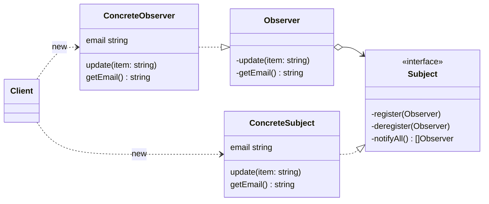

# Observer
インスタンスの変化を他のインスタンスから監視できるようにする

```mermaid
classDiagram
  direction LR
  class Observer {
      -update(item: string)
      -getEmail() string
  }
  class ConcreteObserver {
      email string
      update(item: string)
      getEmail() string
  }
  class Subject {
      <<interface>>
      -register(Observer)
      -deregister(Observer)
      -notifyAll()[]Observer
  }
  class ConcreteSubject {
      email string
      update(item: string)
      getEmail() string
  }
  class Client

  Observer o--> Subject
  ConcreteSubject ..|> Subject
  ConcreteObserver ..|> Observer
  Client ..> ConcreteObserver : new
  Client ..> ConcreteSubject : new
```