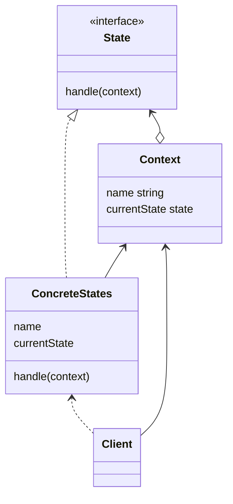

# State
オブジェクトの状態を変化させることで、処理内容を変えられるようにする

```mermaid
classDiagram
  direction BT
  class Context {
      name string
      currentState state
  }
  class State {
      <<interface>>
      handle(context)
  }
  class ConcreteStates {
      name
      currentState
      handle(context)
  }
  class Client

  Context o--> State
  ConcreteStates ..|> State
  ConcreteStates --> Context
  Client ..> ConcreteStates
  Client --> Context
```