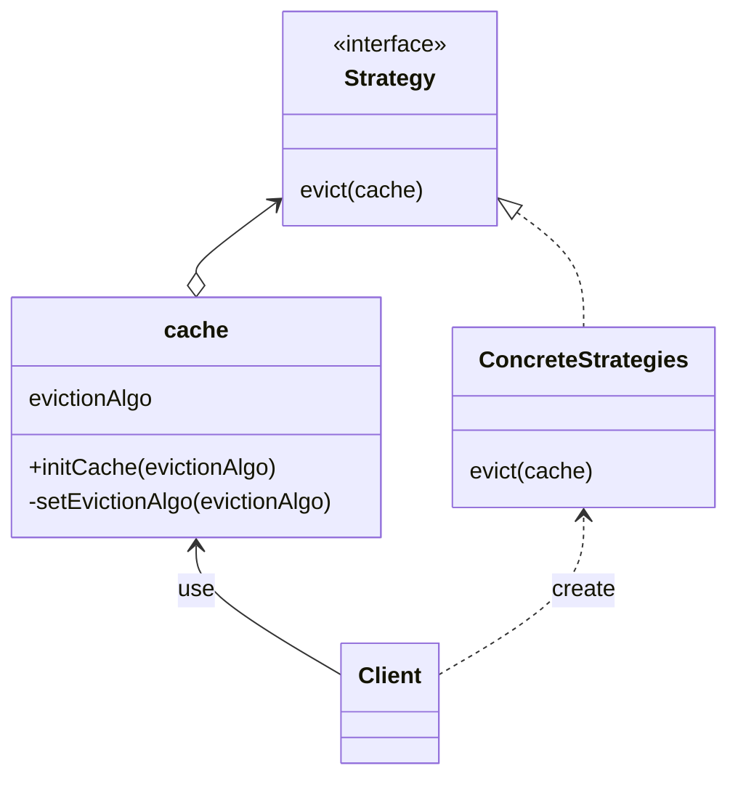

# Strategy
データ構造に対して適用する一連のアルゴリズムをカプセル化し、アルゴリズムの切り替えを容易にする。

```mermaid
classDiagram
  direction BT
  class Client
  class cache{
    evictionAlgo
    +initCache(evictionAlgo)
    -setEvictionAlgo(evictionAlgo)
  }
  class Strategy{
    <<interface>>
    evict(cache)
  }
  class ConcreteStrategies{
    evict(cache)
  }
  Client --> cache: use
  Client ..> ConcreteStrategies: create
  cache o--> Strategy
  ConcreteStrategies ..|> Strategy
```