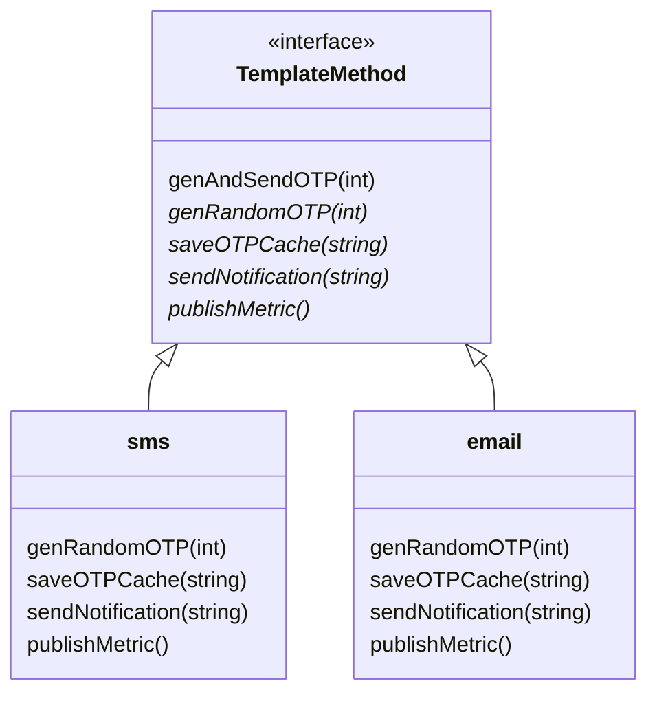

# Template Method
あるアルゴリズムの途中経過で必要な処理を抽象メソッドに委ね、その実装を変えることで処理内容を変えられるようにする

```mermaid
classDiagram
  direction BT
  class TemplateMethod{
    <<interface>>
    genAndSendOTP(int)
    genRandomOTP(int)*
    saveOTPCache(string)*
    sendNotification(string)*
    publishMetric()*
  }
  class sms{
    genRandomOTP(int)
    saveOTPCache(string)
    sendNotification(string)
    publishMetric()
  }
  class email{
    genRandomOTP(int)
    saveOTPCache(string)
    sendNotification(string)
    publishMetric()
  }
  sms --|> TemplateMethod
  email --|> TemplateMethod
```