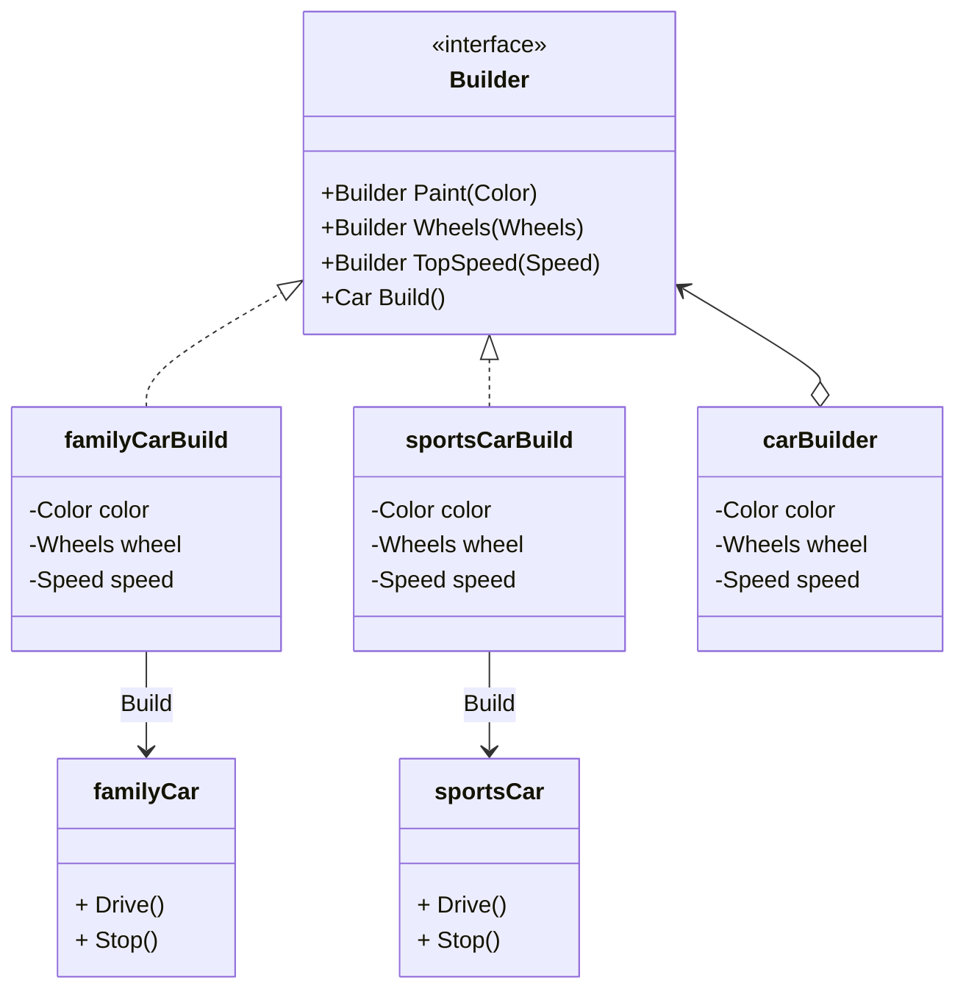

# Builder
複合化されたインスタンスの生成過程を隠蔽する。

```mermaid
classDiagram
    direction BT
    class Builder {
        <<interface>>
        +Builder Paint(Color)
        +Builder Wheels(Wheels)
        +Builder TopSpeed(Speed)
        +Car Build()
    }

    class familyCarBuild {
        -Color color
        -Wheels wheel
        -Speed speed
    }

    class sportsCarBuild {
        -Color color
        -Wheels wheel
        -Speed speed
    }

    class carBuilder {
        -Color color
        -Wheels wheel
        -Speed speed
    }

    class familyCar{
      + Drive()
      + Stop()
    }
    class sportsCar{
      + Drive()
      + Stop()
    }

    familyCar <-- familyCarBuild: Build
    sportsCar <-- sportsCarBuild: Build
    familyCarBuild ..|> Builder
    sportsCarBuild ..|> Builder
    carBuilder o--> Builder
```